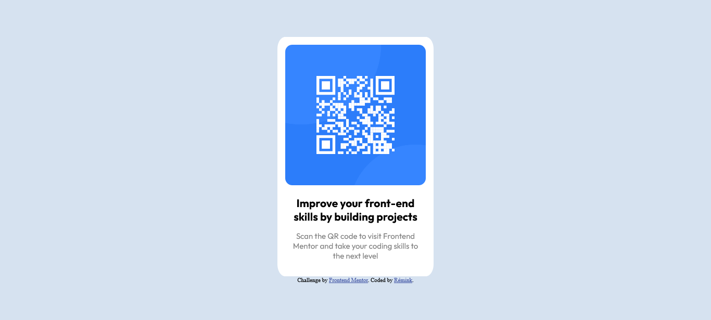

# Frontend Mentor - QR code component solution

This is a solution to the [QR code component challenge on Frontend Mentor](https://www.frontendmentor.io/challenges/qr-code-component-iux_sIO_H). Frontend Mentor challenges help you improve your coding skills by building realistic projects. 

## Table of contents

- [Overview](#overview)
  - [Screenshot](#screenshot)
- [My process](#my-process)
- [Author](#author)

**Note: Delete this note and update the table of contents based on what sections you keep.**

## Overview

### Screenshot

## My process

- I used flexbox, and practiced a bit with width and margins in %.
- To be able to set the width of the image in %, I needed first to set it in a container
- I added a custom font for the first time
- I red a bit of informations about css responsive design, but didn't need it for this project, since a justify-content: center; made my Qr-Code centered for every screen size.
- I needed to set the html height to 100% to make the page take the entire screen to be able to center vertically, not sure why since I didn't have to do that on my other projects !

## Author
Rémink :

GitHub : https://github.com/Remink

Youtube : https://www.youtube.com/channel/UC_XoPOkEpCYMt7HIVtwhFLA
